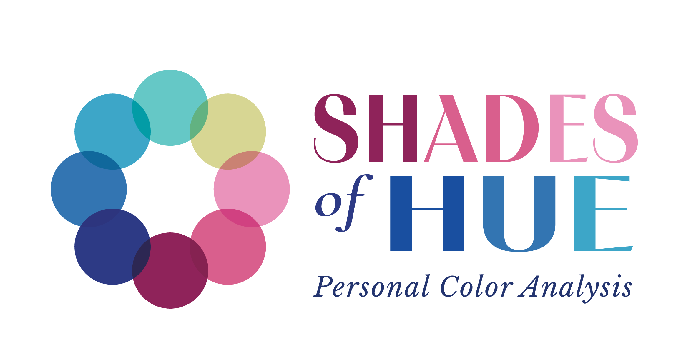

<!DOCTYPE html>
<html lang="en">
<head>
<meta charset="UTF-8">
<meta name="viewport" content="width=device-width, initial-scale=1.0">
<title>Cool Summer Palette</title>

</head>

<body>

<h1>Cool Summer</h1>

Tap color • Swipe to browse

<button id="close" class="close-btn">×</button>

<button id="prev" class="btn">←</button>
<button id="next" class="btn">→</button>

SWIPE

</body>
</html>
